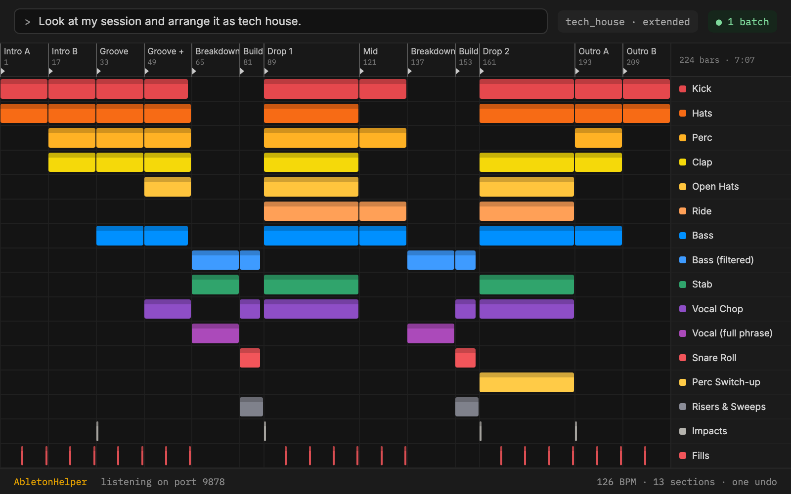

# Ableton Helper

An AI arrangement assistant for Ableton Live 12. You make the loops; Claude turns them into a full, genre-shaped arrangement in Arrangement View — in one batch, in seconds.



See [SPEC.md](SPEC.md) for the full plan (Max for Live chat window, audio analysis, reference-track arranging).

## What it does

- **Skeletons:** "Build me a house skeleton" → one MIDI track per part (Kick, Hats, Bass, Chords, Hook…), named and coloured placeholder clips for every section, locators at each section, and tracks of placeholders for risers, impacts and fills.
- **Arrange your loops:** put your loops in Session View, then "arrange these as tech house". It works out which track is the kick, bass, chords and so on from the names, tiles each loop across the right sections, drops parts out before drops, and adds "(to do)" placeholder tracks for parts you haven't made yet.
- **Custom arrangements:** Claude can describe any arrangement as a plan and build it in one call.

Genres: house (extended, radio), tech house, deep house, techno, drum & bass, UK garage. Templates are YAML files in [`src/ableton_helper/templates/`](src/ableton_helper/templates/), so you can edit them or add your own.

## Setup

Needs [uv](https://docs.astral.sh/uv/) and Ableton Live 12.

```sh
uv sync
uv run ableton-helper install      # copies the Remote Script into your User Library
```

Then in Live: **Preferences → Link, Tempo & MIDI → Control Surface**, pick **AbletonHelper** in a free slot (Input/Output: None). Live shows "AbletonHelper: listening on port 9878" in the status bar.

```sh
uv run ableton-helper status       # checks the connection
```

Claude Code picks up the MCP server from [`.mcp.json`](.mcp.json) when you open this folder. For Claude Desktop, add the same entry to its `claude_desktop_config.json`.

## Try it

In Claude Code, with Live open:

- "Show me the house template" (works without Live)
- "Build a tech house skeleton at 127"
- "Look at my session and arrange it as house. Ask me about anything you can't work out."
- "Add a riser from bar 145 for 16 bars"

Everything a build does is one batch. If you don't like it, undo in Live.

## CLI

```sh
uv run ableton-helper templates             # list genres
uv run ableton-helper preview techno        # print a template's arrangement
uv run ableton-helper bench                 # time one-request-per-change vs batch (use an empty set)
```

## How it works

```
Claude ──MCP──> ableton-helper-mcp (Python)          Ableton Live
                  templates → plan → ops ──TCP 9878──> AbletonHelper Remote Script
                                                        runs the whole op list in one main-thread tick
```

- `remote_script/AbletonHelper/` runs inside Live. `lom.py` holds all Live API code and doesn't import Live, so it's tested against a fake (`tests/fake_live.py`).
- `src/ableton_helper/templates.py` compiles genre templates into bar ranges, gaps and transition placeholders.
- `src/ableton_helper/matching.py` guesses which track plays which part from track and clip names.
- `src/ableton_helper/plan.py` turns a plan in bars into primitive ops: tiling loops, rebuilding partial MIDI tails, locators, clearing.
- `src/ableton_helper/server.py` holds the MCP tools.

Why a batch: [ahujasid/ableton-mcp](https://github.com/ahujasid/ableton-mcp) (which this borrows from; see [THIRD_PARTY_NOTICES.md](THIRD_PARTY_NOTICES.md)) sends one request per change, and every request waits for Live's next main-thread tick. It's also one Claude tool call per change, which is the slow part. Building a 224-bar house skeleton takes about 108 operations: 108 tool calls there, one here. `uv run ableton-helper bench` measures the Live side on your machine and writes the results to `docs/benchmarks.md`.

## Tests

```sh
uv run pytest
```

## Limits

- Claude can't hear the audio yet. Name your tracks and clips well ("Bass – rolling sub", not "Audio 7").
- Audio loops that don't divide a section evenly leave a short empty gap at the end of that section. The Live API can't trim audio clips; MIDI loops are rebuilt exactly.
- Parts can't be cut out of an existing arrangement clip after the fact (the API can't split clips). Gaps are applied when building.
